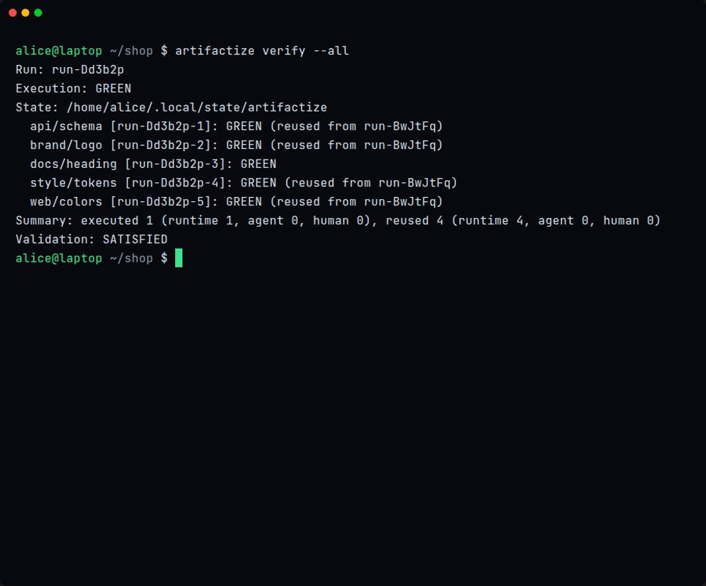
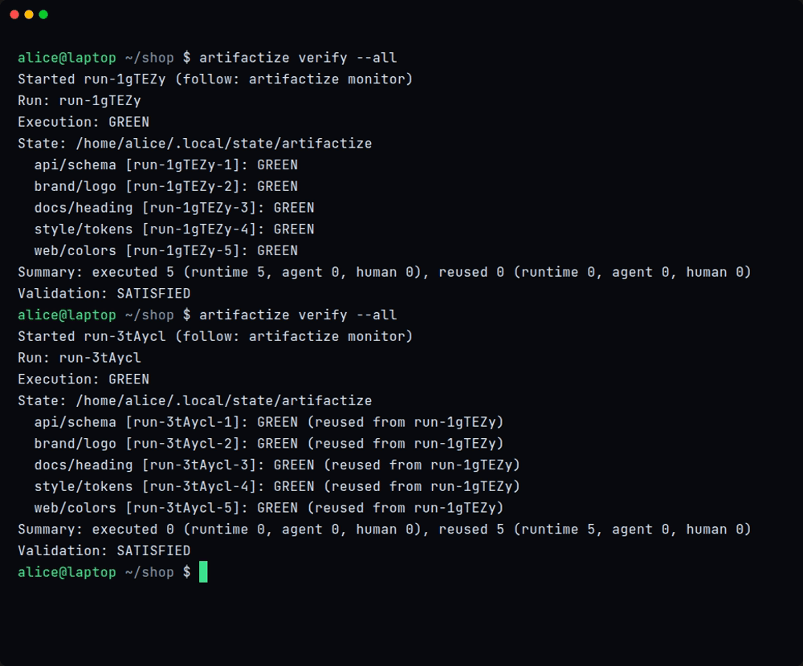
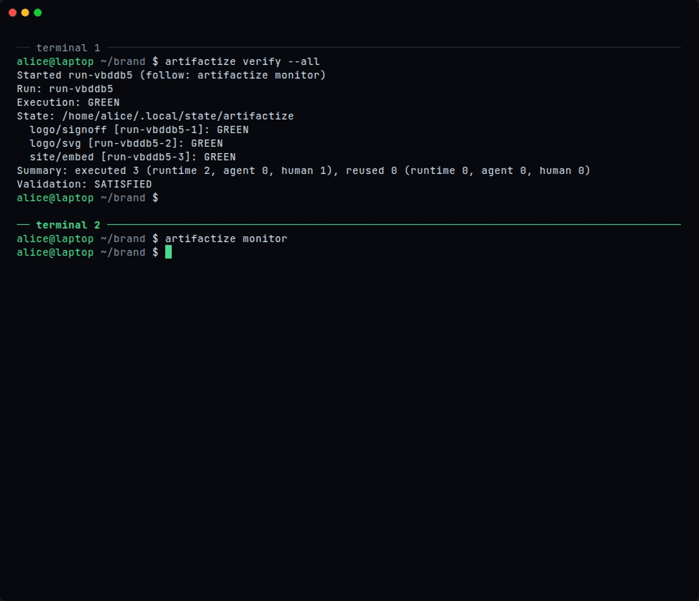
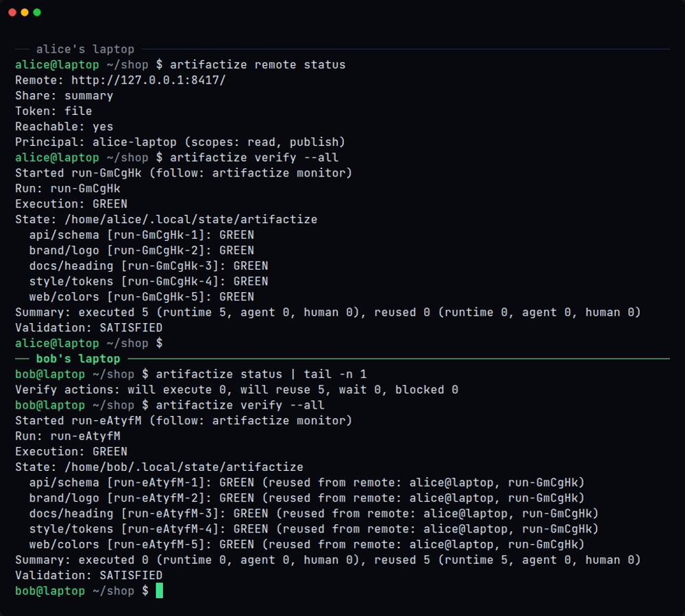

# Artifactize

**Review cost follows the size of a change.** Declare every Artifact (code, docs,
designs, images) and the evals that review it: tests, LLM reviews and human
sign-offs. While an Artifact's fingerprint is unchanged, its GREEN or RED result
is reused, so you pay only for what changed.

<p align="center">
  
</p>

<p align="center">
  <a href="https://artifactize.dev/docs/">Docs</a> ·
  <a href="https://artifactize.dev/docs/getting-started/install.html">Install</a> ·
  <a href="https://artifactize.dev/docs/getting-started/quick-start.html">Quick start</a> ·
  <a href="https://artifactize.dev/docs/reference/overview.html">Reference</a> ·
  <a href="https://artifactize.dev">artifactize.dev</a>
</p>

## Why artifactize

- **Reuse every review that still holds.** A fingerprint is what a review depends
  on; the built-in one hashes the Artifact's own files and its direct dependencies.
  While it is unchanged, `verify` reuses the earlier verdict and reports what it executed, what
  it reused and the tokens reuse saved.
- **Know what a change will cost before you run it.** `status` predicts what
  `verify` will execute, reuse or wait for, and names the files and dependencies
  that changed.
- **Tests, models and people in one graph.** Runtime evals run commands; Agent evals
  ask one exact model (OpenAI or Anthropic API key, ChatGPT sign-in, or the Claude
  CLI) with the read-only tools you declare; Human evals wait for a sign-off. RED
  blocks what depends on it.
- **Human review in the terminal.** `artifactize monitor` shows Runs as they
  progress and hands a waiting sign-off to `artifactize review`.
- **Centralize the reviews, not the repo.** One `artifactize server` shares verdicts
  across machines and CI.

## Install

On Linux or WSL 2, with a Rust toolchain and a C compiler:

```sh
git clone https://github.com/lhj6102/artifactize
cd artifactize
cargo install --path crates/artifactize --locked
artifactize --version          # artifactize 0.4.0
```

[Install](https://artifactize.dev/docs/getting-started/install.html) covers the
prerequisites, the Agent backends, state and uninstalling.

## A tiny example

A folder with an `artifactize.json` is an Artifact. This one, from
[`examples/runtime-relations`](examples/runtime-relations/README.md), checks that a
page has a heading, and `"fingerprint": {}` makes the result reusable while the
folder is unchanged:

```json
{
  "name": "usage",
  "fingerprint": {},
  "evals": [
    {
      "id": "heading",
      "title": "The page has a top-level heading",
      "profile": {
        "kind": "runtime",
        "command": "grep",
        "args": ["-m", "1", "^# ", "page.md"],
        "timeoutMs": 5000
      },
      "payload": {
        "instruction": "Check that {usage} starts with a top-level heading."
      }
    }
  ]
}
```

No model or API key is needed to try it:

```sh
export ARTIFACTIZE_STATE_HOME=$(mktemp -d)   # keep the tour's state apart
cd examples/runtime-relations
artifactize verify --all    # three GREEN results, exit 0
artifactize verify --all    # exit 0 and nothing executes: all three results are reused
```

The [Quick start](https://artifactize.dev/docs/getting-started/quick-start.html)
continues with `status`, a family of Artifacts and a Human sign-off.

## Reuse

`verify` reviews once; the next `verify` reuses every result whose fingerprint is
unchanged and says where each came from.



[Fingerprints and reuse](https://artifactize.dev/docs/concepts/fingerprints-and-reuse.html) ·
[Runs, status and validation](https://artifactize.dev/docs/concepts/runs-and-status.html)

## Human review in the terminal

`verify --wait` keeps the Run alive while a Human eval waits. In the monitor, `o`
opens the waiting request in `artifactize review`: run the tools its owner declared,
submit the verdict through a form, and the Run finishes.



[Human reviews](https://artifactize.dev/docs/guides/human-reviews.html)

## Team review store

Each machine keeps its own checkout and state. One `artifactize server` holds one
record per fingerprint and Eval definition, so a review done on one laptop is reused
on the next and in CI. A read-only CI token reuses but never publishes.



[Team review store](https://artifactize.dev/docs/guides/team-review-store.html) ·
[CI](https://artifactize.dev/docs/guides/ci.html) ·
[Walkthrough](https://artifactize.dev/docs/guides/team-walkthrough.html)

## Documentation

Everything else is at **[artifactize.dev/docs](https://artifactize.dev/docs/)**:

- [Concepts](https://artifactize.dev/docs/concepts/artifacts-and-evals.html): Artifacts, evals, fingerprints, Runs and status.
- [Guides](https://artifactize.dev/docs/guides/agent-evals.html): Agent evals and backends, Human reviews, the team review store and CI.
- [Reference](https://artifactize.dev/docs/reference/overview.html): every command and flag, `artifactize.json`, tools, state, limits and the review store protocol.
- [Examples](https://artifactize.dev/docs/getting-started/examples.html): runtime relations, Agent and Human tools, families.

The recordings above are reproducible: their VHS tapes and demo projects are in
[`website/demo`](website/demo) ([how to record](website/README.md#recordings)).

Artifactize is a lean Rust port and rebrand of [CCDD](https://github.com/lhj6102/ccdd)
7.0.0 (`cbf28b4`); the [plan](docs/PLAN.md) records the scope. It runs on Linux and WSL.

## License

Licensed under the [Apache License, Version 2.0](LICENSE).
